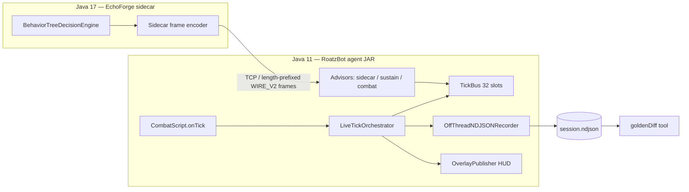
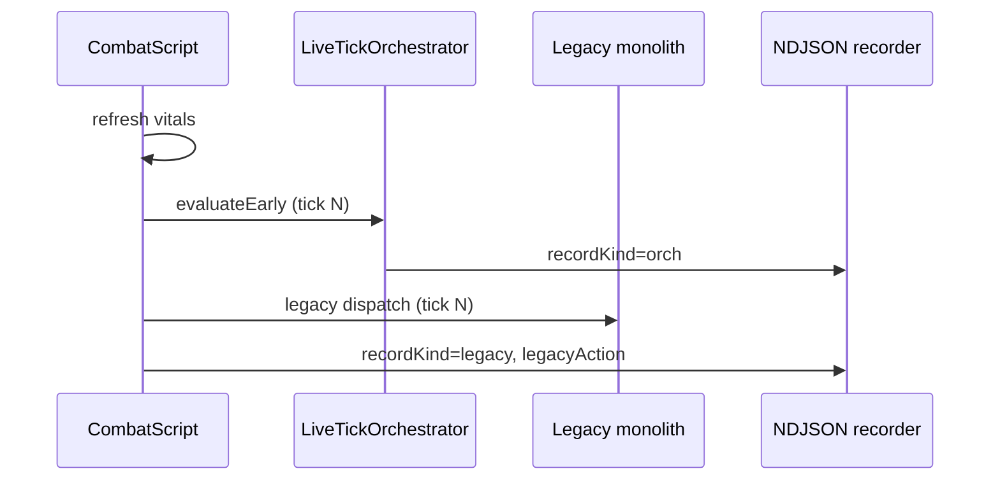

# RoatzBot + EchoForge + TickBus — Architecture Overview

**Repository:** [maxrevenue/maxrevenue](https://github.com/maxrevenue/maxrevenue)  
**Integration trunk:** `integration/roatz-de09` (Roatz combat bot; `main` is a separate Pivex product line)  
**Status (Mar 2026):** TickBus orchestrator + shadow harness **implemented on PR #21**; **first shadow NDJSON capture not run yet** — advisor vs legacy parity is the open validation gate.

This document is written for external collaborators (e.g. Gemini) who need the full system picture without reading the whole repo.

---

## 1. Executive summary

Roatz is a **Java 11** OSRS PvP combat agent attached to a RuneLite-based client. **EchoForge** is a **Java 17** behavior-tree / decision engine developed in parallel. Production integration goal:

- **Agent JAR stays Java 11** — no EchoForge classes shipped inside the agent.
- EchoForge runs as a **sidecar** (separate JVM) and sends **intents over a binary wire protocol**.
- On-tick combat arbitration is moving from a **legacy monolith** (`CombatScript`) to a **zero-allocation TickBus orchestrator** (`LiveTickOrchestrator`) with **transcribed advisors** that mirror legacy behavior before EchoForge owns decisions.

Validation strategy: **shadow mode** — orchestrator evaluates and records telemetry while **legacy still dispatches**. Offline tool **`goldenDiff`** compares orchestrator winners vs legacy `lastAction` per tick. **Legacy is the oracle; transcription is the candidate.**

---

## 2. Two-JVM topology



| Component | JVM | Role |
|-----------|-----|------|
| RoatzBot agent | 11 | Client attach, vitals, legacy combat, TickBus, telemetry, paint overlays |
| EchoForge sidecar | 17 | Heavy decision logic; emits intents with TTL + fingerprint preconditions |
| NDJSON session file | — | Shadow/replay truth source; schema v2 frozen pre-first-capture |
| `goldenDiff` | 11 (Gradle tool) | Parity verdict vs legacy dispatch |

---

## 3. Repository layout (Roatz-relevant)

| Path | Purpose |
|------|---------|
| `src/com/bot/core/bus/` | `TickBus`, `Intent`, `IntentPool`, `Channel`, `Advisor`, `ActionKind` |
| `src/com/bot/core/orchestrator/` | `LiveTickOrchestrator`, `ChannelRules`, `SuppressionTable`, `ReflectionDispatcher`, `TickResolutionSnapshot` |
| `src/com/bot/core/model/` | `GameState`, `CombatTickState`, `FingerprintLayout` |
| `src/com/bot/core/telemetry/` | `OffThreadNDJSONRecorder`, `TickRecord`, `LegacyComparability` |
| `src/com/bot/core/sidecar/` | `AsyncSidecarAdvisor`, `SidecarFrameCodec`, metrics, wire reject logging |
| `src/com/bot/overlay/` | Paint-thread HUD + winner tile overlay (debug only) |
| `src/com/sun/java/fontmgr/` | Legacy `CombatScript`, `TickBusHooks`, `TickBusIntegration`, transcribed advisors |
| `src/com/sun/java/fontmgr/overlay/` | RuneLite paint hook, `GameOverlay` registry |
| `docs/tickbus-wire-contract.md` | Authoritative wire + shadow + schema contract |
| `tools/tickbus/GoldenDiffTool.java` | Offline shadow session analyzer |

---

## 4. Single-tick control flow (shadow baseline)

Hook order in `CombatScript.onTick` is **fixed** — wrong order produces false `TIMING_DIFF` in golden review:

1. **Vitals refresh** — hitsplat, PvP vitals, HP drop notes.
2. **`TickBusHooks.evaluateEarly`** — `LiveTickOrchestrator.onTick` on **pre-legacy** state (`CombatTickStateAdapter`).
3. **Legacy monolith** — auto-prayer, NH, spec dumps, etc. (still runs when `-Droatz.tickbus.shadow=true`).
4. **`publishState`** → **`TickBusHooks.recordShadowLegacy`** — pairs `script.lastAction` with the orch NDJSON line for that tick.



### Orchestrator internal pipeline (tick thread, zero allocation hot path)

1. `SuppressionTable.onVitals` — early-release eat leases on HP recovery.
2. `TickBus.beginTick` / `clear` — reset bus + per-tick drop counters.
3. Each **Advisor** `evaluate(state, bus)` — `IntentPool.obtain` → `bus.publish(intent)` → `pool.release()`.
4. **Resolve** three channels: OFFENSIVE (0), SUSTAIN (1), DEFENSIVE (2) — highest rank valid intent per channel, respecting suppression.
5. **`ChannelRules.applyExclusiveRules`** — e.g. eat suppresses offensive same tick; equip noop if already worn; spec if energy &lt; 50%.
6. **Dispatch order:** DEFENSIVE → SUSTAIN → OFFENSIVE (prayer/gear before food before attack).
7. **`TickResolutionSnapshot`** — one pass output: winners, `EliminationReason[]`, dispatch ordinals → **NDJSON recorder + overlay** (must not diverge).
8. Apply **suppression leases** on dispatched kinds (eat 3 ticks, equip 1, prayer 1, spec until available tick).

---

## 5. TickBus and intent model

- **Capacity:** 32 intents per tick, fixed array, no allocations on hot path.
- **Rank:** `(priority.weight << 8) | (128 - advisorOrdinal)` — higher wins; tie keeps incumbent.
- **Overflow:** When full, evict **lowest rank** only if incoming **strictly outranks** it; else drop incoming. NDJSON records `droppedPublishes` + `maxRankDropped` (spike = advisor bug, not missing sort).
- **TTL (sidecar + bus):** Intent valid iff `tick >= bornTick && tick <= bornTick + ttlTicks` (**inclusive**, no +1 fudge).
- **Fingerprints:** `(stateFp & mask) == (hash & mask)`; `mask == 0` → unconditional (+ `masklessIntents` counter for golden scrutiny).

### Channels

| Index | Channel | Typical kinds |
|-------|---------|----------------|
| 0 | OFFENSIVE | ATTACK, SPECIAL |
| 1 | SUSTAIN | EAT, SIP |
| 2 | DEFENSIVE | PRAYER, EQUIP |

---

## 6. Advisors (current transcription phase)

| Advisor | Ordinal | Source | Notes |
|---------|---------|--------|-------|
| `AsyncSidecarAdvisor` | 0 | EchoForge wire | `-Droatz.sidecar=` enables; `-Droatz.sidecar.observe=true` = decode/observe only, no bus publish |
| `SustainAdvisor` | 1 | Legacy eat paths | Transcribed from `CombatScript` |
| `CombatAdvisor` | 2 | Legacy spec/attack | Transcribed from `CombatScript` |

Long-term: EchoForge sidecar replaces transcription; shadow golden must pass before flipping dispatch ownership.

---

## 7. EchoForge sidecar wire (summary)

- **Version byte** + body: **WIRE_V1** (32 B body, not fully decoded yet) / **WIRE_V2** (40 B body).
- **Reject path:** truncated frame, version mismatch → **`SidecarWireRejectLog`** + `sidecarWireFrameRejects` (never silent close). Separate from watchdog “healthy” lag policy (deferred hysteresis).
- **Health:** ack lag vs `ackTick`; unhealthy skips publish for that tick; healthy resets on fresh payload.
- Full detail: `docs/tickbus-wire-contract.md`, `SidecarFrameCodec`.

### Fingerprint registry (seed)

| Field | Bits | Used by |
|-------|------|---------|
| Local HP | 0–7 | SustainAdvisor, eat preconds |
| Spec energy | 16–23 | CombatAdvisor spec gate |

Rule: new sidecar-precondition fields must register here or be explicitly waived.

---

## 8. Shadow telemetry (NDJSON schema v2 — frozen)

**Orchestrator line** (`recordKind: "orch"`, `schemaVersion: 2`):

- `replayProjection`: `fingerprint`, `localHp`, `specEnergy`, `specAvailableFromTick` — **replay reads; never recomputes RNG/client state**.
- `busIntents[]`: kind, priority, advisor, rank, item/npc/slot, bornTick, ttlTicks.
- `winners[]`, `channelDrops[]`, `dispatchState[]`.
- `droppedPublishes`, `maxRankDropped`, sidecar metrics + `sidecarWireFrameRejects`.

**Legacy line** (`recordKind: "legacy"`):

- `legacyAction` — monolith oracle for that tick.
- `uncomparableSubtype` when not diffable: **`NO_OPINION`** (empty/no action) or **`OUT_OF_VOCAB`** (outside captured vocabulary) — set at record time via `LegacyComparability`.

Recorder: tick thread fills `TickRecord` ring slots → daemon thread writes NDJSON (no I/O on hot path).

---

## 9. Parity tool: `goldenDiff`

```bash
./gradlew goldenDiff -Psession=/path/to/session.ndjson
```

**Compares:** orch channel winners vs **`legacyAction`** on same `tickIndex`.

**Categories:**

| Bucket | Meaning |
|--------|---------|
| MATCH | Agreement |
| RULE_DIFF | Orchestrator cleared winner; legacy acted |
| PRIORITY_DIFF | Both acted; different choice |
| TIMING_DIFF | Orch line without legacy line (pairing) |
| FEASIBILITY | Stub dispatch (LABEL_ONLY / NO_DISPATCHER) |
| UNCOMPARABLE | Legacy no opinion or out of vocab — **excluded from rates**; subtypes **NO_OPINION** / **OUT_OF_VOCAB** reported |

**Reading protocol (after capture):**

- Stable counts + RULE_DIFF in known stub gaps → continue advisor transcription.
- TIMING_DIFF clustered ±1 around eats → hook order / vitals refresh bug.
- FEASIBILITY ≠ 0 → diff tool / dispatcher config, not advisors.
- High UNCOMPARABLE/OUT_OF_VOCAB → expand legacy vocabulary capture, not logic.

---

## 10. Debug overlay (paint thread)

Enable: `-Droatz.overlay=true` (with tickbus on). **Not a decision brain.**

- `OverlayPublisher`: double-buffer A/B; fill-then-set; optional one-frame tear under lag — **debug only; no automation on frame consistency**.
- `TickBusHudOverlay`: precomputed strings only (`tickIndex`, `publishSequence`, STALE if frozen, lease line, channel lines with `drop=` reasons, sidecar `†` if `bornTick != tickIndex`).
- `TickBusWinnerTileOverlay`: colors interacting target tile by channel winner (verifier, not timing signal).
- Drop reasons same source as NDJSON: `TickResolutionSnapshot` from orchestrator.

---

## 11. System properties (flags)

| Property | Effect |
|----------|--------|
| `-Droatz.tickbus=true` | Orchestrator enabled |
| `-Droatz.tickbus.shadow=true` | Orchestrator evaluates + records; **legacy still dispatches** |
| `-Droatz.tickbus.rec=<path>` | NDJSON output path |
| `-Droatz.overlay=true` | HUD + tile overlays on existing paint hook |
| `-Droatz.sidecar=<host>` | Sidecar advisor enabled (socket reader wiring) |
| `-Droatz.sidecar.observe=true` | Observe wire only; do not publish sidecar intents to bus |

**Shadow capture (operator):**

```text
-Droatz.tickbus=true
-Droatz.tickbus.shadow=true
-Droatz.tickbus.rec=<path>/session.ndjson
-Droatz.overlay=true
```

---

## 12. Definition of done (flip to production tickbus)

1. Two shadow sessions, stable category distributions.
2. `FEASIBILITY=0` on reviewed sessions.
3. `NoAllocationTest` green.
4. `-Droatz.tickbus=true` **without** shadow; recorder on for second validation pass.
5. RULE_DIFF ticks: HUD `drop=` must match NDJSON (single resolution pass).

---

## 13. Related PRs (EchoForge stack)

| PR | Theme |
|----|--------|
| #17 | EchoForge core engine |
| #18 | NDJSON + goldens |
| #19 | SpecStrategy + reflection bridge |
| **#21** | **TickBus orchestrator, shadow NDJSON, overlay, goldenDiff** (base: `integration/roatz-de09`) |

EchoForge repo logic is **not** embedded in the agent JAR; integration is **wire + NDJSON + shadow parity**.

---

## 14. Design invariants (do not break)

1. **Time base:** `GameState.tickIndex` / server tick only for TTL and suppression.
2. **Zero allocation** on tick thread in orchestrator path (pools, fixed arrays, no bus snapshot on tick thread).
3. **Single resolution pass** for recorder, overlay, and elimination reasons.
4. **Legacy oracle** for shadow parity — not advisor isolation tests.
5. **Schema v2 frozen** before first shadow capture; changes require recapture.
6. **Java 11 agent / Java 17 sidecar** separation for production.

---

## 15. Open / deferred (explicit)

| Item | Tier |
|------|------|
| First shadow session + goldenDiff counts | **Operator gate** |
| Watchdog two-threshold hysteresis | Deferred (observe-only sidecar in shadow) |
| ChannelRules as generated data table | Tier 2 polish |
| Fingerprint coverage enforcement test | Tier 2 |
| Sidecar socket reader production wiring | Post–parity flip |
| PRAYER lease early-release via fingerprint bit | TBD in registry |

---

## 16. Key references in repo

- Contract: `docs/tickbus-wire-contract.md`
- Implementation skill / prompt: `.cursor/skills/roatz-tickbus-orchestrator/`
- Tests: `./gradlew test --tests 'com.bot.core.*' 'com.bot.overlay.*'`

---

*Generated for external architecture review. For line-level API detail, start with `LiveTickOrchestrator`, `TickBusIntegration`, and `docs/tickbus-wire-contract.md`.*
