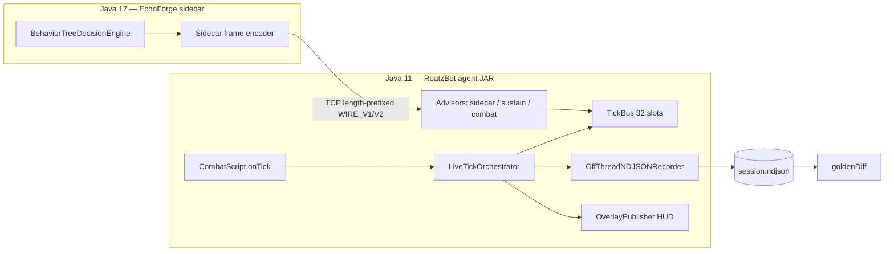

# RoatzBot + EchoForge + TickBus — Shareable Architecture (schema v2)

**Repository:** [maxrevenue/maxrevenue](https://github.com/maxrevenue/maxrevenue)  
**Integration trunk:** `integration/roatz-de09` (Roatz combat bot; `main` is a separate Pivex product line)  
**TickBus work:** PR [#21](https://github.com/maxrevenue/maxrevenue/pull/21) (`cursor/tickbus-orchestrator-bus-bae7`)  
**As of:** 2026-09-18 — NDJSON **schema v2 frozen** (rev 2); **first shadow capture not run** — operator `goldenDiff` is the open gate.

Standalone overview for external reviewers (e.g. Gemini). Authoritative line-level contract: `docs/tickbus-wire-contract.md`. Bit layout source of truth: `docs/fingerprint-registry.md`.

---

## 1. Executive summary

Roatz is a **Java 11** OSRS PvP combat agent on a RuneLite-based client. **EchoForge** is a **Java 17** behavior-tree engine in parallel.

| Goal | Approach |
|------|----------|
| Keep agent on Java 11 | EchoForge runs as a **sidecar JVM**; intents over a **binary wire** |
| Replace monolith dispatch safely | **TickBus orchestrator** + **transcribed advisors** mirror `CombatScript` before EchoForge owns decisions |
| Prove equivalence | **Shadow mode**: orchestrator evaluates + records; **legacy still dispatches**. **`goldenDiff`** compares orch winners vs `legacyAction`. **Legacy = oracle; transcription = candidate.** |

---

## 2. Two-JVM topology



---

## 3. Shadow hook order (fixed — do not reorder)

In `CombatScript.onTick`:

1. Vitals refresh (`readLatestHitsplat`, `refreshPvpVitals`, `noteLocalHpDrop`)
2. **`TickBusHooks.evaluateEarly`** — orchestrator on **pre-legacy** state
3. Legacy monolith (still runs when `-Droatz.tickbus.shadow=true`)
4. **`publishState`** → **`TickBusHooks.recordShadowLegacy`** — pairs `lastAction` with orch line for same `tickIndex`

Wrong order → false **TIMING_DIFF** and HP/prayer artifacts, not advisor bugs.

---

## 4. Orchestrator pipeline (tick thread, zero allocation)

1. `SuppressionTable.onVitals` — EAT lease early-release when `localHp > comboEatHpThreshold` (not “any HP tick-up”; sub-threshold regen must not release eat early)
2. `TickBus.beginTick` / clear — reset bus + per-tick drop counters
3. Each **Advisor** `evaluate` → `IntentPool.obtain` → `bus.publish` → `pool.release`
4. Resolve channels **OFFENSIVE (0), SUSTAIN (1), DEFENSIVE (2)** — highest rank valid intent, suppression applied
5. **`ChannelRules.applyExclusiveRules`** — eat vs offensive, equip noop, spec energy gate, etc.
6. **Dispatch order:** **DEFENSIVE → SUSTAIN → OFFENSIVE**
7. **`TickResolutionSnapshot`** — single pass: winners, `EliminationReason[]`, dispatch ordinals → **NDJSON + overlay** (must match)
8. Suppression leases on dispatch (EAT 3t, EQUIP 1t, PRAYER 1t, SPECIAL until `specAvailableFromTick`)

### Advisors (transcription phase)

| Ordinal | Advisor | Source |
|---------|---------|--------|
| 0 | `AsyncSidecarAdvisor` | EchoForge wire (`-Droatz.sidecar=`; `-Droatz.sidecar.observe=true` = decode only, no bus publish) |
| 1 | `SustainAdvisor` | Legacy eat (`hp <= comboEatHpThreshold`) |
| 2 | `CombatAdvisor` | Legacy spec/attack |

---

## 5. TickBus + intents

- **32 slots/tick**, fixed array, hot path no allocations
- **Rank:** `(priority.weight << 8) | (128 - advisorOrdinal)`
- **Overflow:** evict lowest rank only if incoming **strictly outranks**; else drop incoming → NDJSON `droppedPublishes`, `maxRankDropped` (`-1` if none)
- **TTL:** valid iff `tick >= bornTick && tick <= bornTick + ttlTicks` (**inclusive**)
- **Fingerprints:** `(stateFp & mask) == (hash & mask)`; `mask == 0` → unconditional + `masklessIntents` counter

### Fingerprint registry (authoritative)

| Field | Bits | Source | Consumers |
|-------|------|--------|-----------|
| Local HP | 0–7 | `localHp()` | SustainAdvisor, sidecar eat preconds |
| Food present | 8 | `foodSlotIndex >= 0` | SustainAdvisor |
| Protect prayer active | 9 | `CombatScript.protectPrayerMaskForTelemetry()` | PRAYER suppression early-release, bit 9 |
| Spec energy | 16–23 | `specEnergyPercent()` | CombatAdvisor, sidecar |

New sidecar-precondition fields → register in `FingerprintRegistry` + `docs/fingerprint-registry.md` or document waiver.

### Suppression early-release (candidate-only; expect RULE_DIFF clusters vs legacy)

| Kind | Lease | Early release |
|------|-------|----------------|
| EAT / SIP | 3 ticks | `localHp > eatThreshold` where `eatThreshold = CombatScript.comboEatHpThreshold` (default **32**). Advisor eats at `hp <= threshold`; lease invalidates **strictly above** threshold. |
| PRAYER | 1 tick | `protectPrayerMask == 0` (bit 9 / telemetry mask) |
| EQUIP | 1 tick | Timeout only |
| SPECIAL | until cooldown tick | Timeout only |

---

## 6. Sidecar wire (summary)

- Leading **version byte**: **WIRE_V1** (32 B body) / **WIRE_V2** (40 B body) — see `SidecarFrameCodec`
- **Reject path:** malformed/truncated/version mismatch → increment **`wireRejects`**, `SidecarWireRejectLog` (no silent socket close), reader stays alive with backoff
- **Health:** ack lag vs `ackTick`; unhealthy skips publish; resets on valid payload
- Watchdog hysteresis deferred during shadow (observe-only path)

---

## 7. NDJSON schema v2 (frozen — do not change without recapture)

**Replay rule:** replay reads **`replayProjection`** from NDJSON; never re-derive vitals/RNG from live client.

### `recordKind: "orch"` (`schemaVersion: 2`)

**`replayProjection`** (matches `OffThreadNDJSONRecorder`):

| Field | Notes |
|-------|--------|
| `fingerprint` | `FingerprintRegistry.compose(...)` |
| `localHp`, `specEnergy`, `foodSlotIndex`, `protectPrayerMask` | Registry bits 0–7, 8, 9, 16–23 |
| `eatThreshold` | `comboEatHpThreshold` — EAT lease input |
| `specAvailableFromTick` | SPECIAL lease / cooldown |
| `damageTaken` | **Per-tick** HP drop on orch lines (vitals delta). **Not** session-cumulative `damageTaken` on periodic lines — same field name, different `recordKind`. |
| `targetNpcIndex` | `-1` reserved until target transcription lands |

**`busIntents[]`:** `kind`, `priority`, `advisorOrdinal`, `rank`, `itemId`, `npcIndex`, `slotIndex`, `bornTick`, `ttlTicks`, interned `byline`, `elimination` on losers.

**Also:** `winners[]`, `channelDrops[]`, `dispatchState[]`, `busSize`, `droppedPublishes`, `maxRankDropped`, `recordsDropped`, sidecar observe fields (`masklessIntents`, `sidecarAckLag`, `sidecarHealthy`, `staleTickDrops`, `staleStateDrops`, **`wireRejects`**).

### `recordKind: "legacy"`

`legacyAction` + optional `uncomparableSubtype`: **`NO_OPINION`** | **`OUT_OF_VOCAB`** (`LegacyComparability` at record time).

### `recordKind: "periodic"` (every **50 ticks**, best-effort on close)

Outcome counters from **projection transitions only** (not winners/dispatch): `eatsUsed`, `specsUsed`, `prayerUptimeTicks`, **`damageTaken`** (session-cumulative here).  
`sidecarArrivalLagTicks` p50/p99 (histogram of `arrivalTickIndex - targetTickIndex`).

**`goldenDiff`** uses **`ParityInput`** only — periodic/outcome/latency fields **do not** affect classification.

---

## 8. Parity gate: `goldenDiff`

```bash
./gradlew goldenDiff -Psession=/path/to/session.ndjson
```

Compares resolved **orch channel winners** vs **`legacyAction`** per `tickIndex`.

| Category | Meaning |
|----------|---------|
| MATCH | Agreement |
| RULE_DIFF | Orch cleared winner; legacy acted |
| PRIORITY_DIFF | Both acted; different choice |
| TIMING_DIFF | Orch without paired legacy line |
| FEASIBILITY | Stub dispatch (LABEL_ONLY / NO_DISPATCHER) |
| UNCOMPARABLE | **Excluded from rates** — subtypes **NO_OPINION** / **OUT_OF_VOCAB** |

**Parity oracle:** legacy monolith dispatch at `recordShadowLegacy`; transcribed advisors are never the reference.

**Overlay cross-check:** on RULE_DIFF ticks, HUD `drop=` must match NDJSON `channelDrops` (same `TickResolutionSnapshot` pass).

---

## 9. Operator capture (only open validation gate)

```text
-Droatz.tickbus=true
-Droatz.tickbus.shadow=true
-Droatz.tickbus.rec=./logs/session_01.ndjson
-Droatz.overlay=true
```

Then paste **`goldenDiff`** counts: **MATCH, RULE_DIFF, PRIORITY_DIFF, TIMING_DIFF, FEASIBILITY, UNCOMPARABLE** (NO_OPINION / OUT_OF_VOCAB).

**Flip to production tickbus (drop shadow):**

1. Two shadow sessions, stable category distributions  
2. `FEASIBILITY=0` on reviewed sessions  
3. `NoAllocationTest` green  
4. `-Droatz.tickbus=true` without shadow; recorder on for second pass  

---

## 10. Debug overlay

`-Droatz.overlay=true` with tickbus — paint thread only; **not a decision brain**.

- Double-buffer `OverlayPublisher`; one-frame tear possible under lag (debug only)
- Precomputed HUD: `tickIndex`, `publishSequence`, STALE, leases, channel lines + `drop=`, sidecar `†` when `bornTick != tickIndex`
- `TickBusWinnerTileOverlay` — verifier on target tile, not timing signal

---

## 11. Repo map (Roatz-relevant)

| Path | Role |
|------|------|
| `src/com/bot/core/orchestrator/` | `LiveTickOrchestrator`, `SuppressionTable`, `FingerprintRegistry`, `TickResolutionSnapshot` |
| `src/com/bot/core/bus/` | `TickBus`, `Intent`, `IntentPool`, advisors |
| `src/com/bot/core/telemetry/` | `OffThreadNDJSONRecorder`, `TickRecord`, `LegacyComparability` |
| `src/com/bot/core/golden/` | `ParityInput`, `GoldenParityClassifier` |
| `src/com/bot/core/sidecar/` | Wire codec, metrics, `SidecarWireRejectLog` |
| `src/com/sun/java/fontmgr/` | `CombatScript`, `TickBusHooks`, transcribed advisors |
| `tools/tickbus/GoldenDiffTool.java` | Offline analyzer |
| `docs/tickbus-wire-contract.md` | Full contract + landed/remaining checklist |
| `docs/fingerprint-registry.md` | Bit layout source of truth |
| `docs/SCHEMA_FREEZE_DECISIONS.md` | Rev 2 decision log |

---

## 12. Landed on PR #21 (rev 2) vs remaining

**Landed:** schema v2 projection + full `busIntents[]`, overflow/queue counters, `UNCOMPARABLE` subtypes, `ParityInput` gate, sidecar **`wireRejects`**, EAT/PRAYER suppression + tests, periodic NDJSON cadence, overlay tied to single resolution pass, fingerprint registry + tests.

**Remaining:** first operator shadow capture + category paste; `targetNpcIndex` transcription; generated `ChannelRules` table polish; watchdog hysteresis when sidecar publishes; optional session-close `flushPeriodicBestEffort` wiring.

---

## 13. Design invariants

1. **Time base:** server tick / `GameState.tickIndex` for TTL and suppression  
2. **Zero allocation** on orchestrator hot path  
3. **One resolution pass** for recorder, overlay, elimination reasons  
4. **Legacy oracle** for shadow parity  
5. **Schema v2 frozen** — changes require recapture  
6. **Java 11 agent / Java 17 sidecar** in production  

---

*For implementation entry points: `LiveTickOrchestrator`, `TickBusIntegration`, `OffThreadNDJSONRecorder`, `docs/tickbus-wire-contract.md`.*
